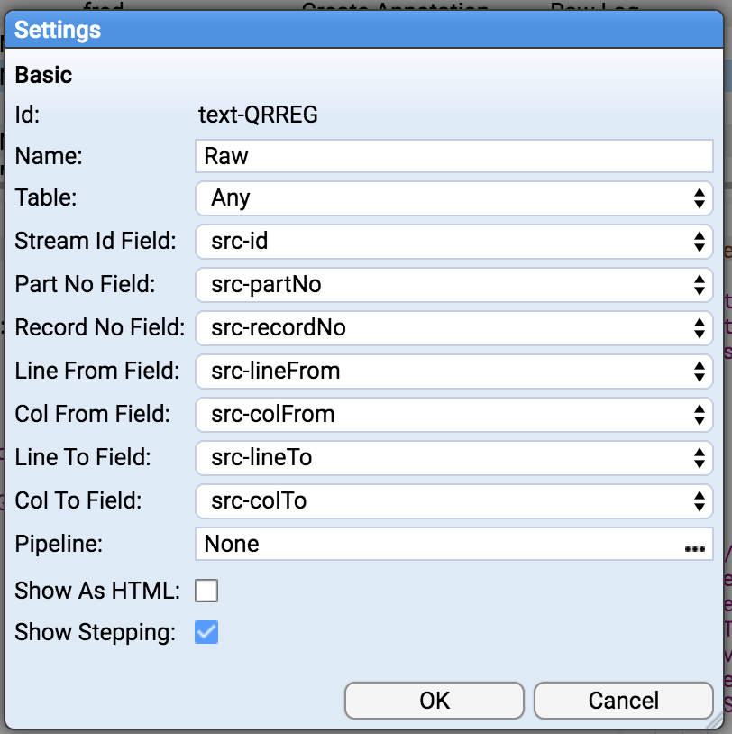

Link every Event back to the Raw log
==

Stroom v6 introduced a new feature (_stroom:source()_) to allow a translation developer to obtain positional details of the source file that is currently being processed.  Using the positional information it is possible to tag Events with sufficient details to link back to the Raw source.

## Assumptions
1. You have a working pipeline that processes events into Events.
2. Events are indexed
3. You have a Dashboard uses a Search Extraction pipeline.

## Steps
1. Create a new XSLT called Source Decoration containing the following:
```
<xsl:stylesheet xpath-default-namespace="event-logging:3" xmlns:sm="stroom-meta" xmlns="event-logging:3" xmlns:rec="records:2" xmlns:stroom="stroom"  version="3.0" xmlns:xsl="http://www.w3.org/1999/XSL/Transform">
  <xsl:template match="@*|node()">
    <xsl:copy>
      <xsl:apply-templates select="@*|node()" />
    </xsl:copy>
  </xsl:template>
  <xsl:template match="Event/Meta[not(sm:source)]">
    <xsl:copy>
      <xsl:apply-templates />
      <xsl:copy-of select="stroom:source()" />
    </xsl:copy>
  </xsl:template>
  <xsl:template match="Event[not(Meta)]">
    <xsl:copy>
      <xsl:element name="Meta">
        <xsl:copy-of select="stroom:source()" />
      </xsl:element>
      <xsl:apply-templates />
    </xsl:copy>
  </xsl:template>
</xsl:stylesheet>
```
This XSLT will add or augment the Meta section of the Event with the source details.
2. Insert a new XSLT filter into your translation pipeline after your translation filter and set it to the XSLT created above.
3. Reprocess the Events through the modified pipeline, also ensure your Events are indexed.
4. Amend the translation performed by the Extraction pipeline to include the new data items that represent the source position data. Add the following to the XSLT:
```
<xsl:element name="data">
  <xsl:attribute name="name">
    <xsl:text>src-id</xsl:text>
  </xsl:attribute>
  <xsl:attribute name="value" select="Meta/sm:source/sm:id" />
</xsl:element>
<xsl:element name="data">
  <xsl:attribute name="name">
    <xsl:text>src-partNo</xsl:text>
  </xsl:attribute>
  <xsl:attribute name="value" select="Meta/sm:source/sm:partNo" />
</xsl:element>
<xsl:element name="data">
  <xsl:attribute name="name">
    <xsl:text>src-recordNo</xsl:text>
  </xsl:attribute>
  <xsl:attribute name="value" select="Meta/sm:source/sm:recordNo" />
</xsl:element>
<xsl:element name="data">
  <xsl:attribute name="name">
    <xsl:text>src-lineFrom</xsl:text>
  </xsl:attribute>
  <xsl:attribute name="value" select="Meta/sm:source/sm:lineFrom" />
</xsl:element>
<xsl:element name="data">
  <xsl:attribute name="name">
    <xsl:text>src-colFrom</xsl:text>
  </xsl:attribute>
  <xsl:attribute name="value" select="Meta/sm:source/sm:colFrom" />
</xsl:element>
<xsl:element name="data">
  <xsl:attribute name="name">
    <xsl:text>src-lineTo</xsl:text>
  </xsl:attribute>
  <xsl:attribute name="value" select="Meta/sm:source/sm:lineTo" />
</xsl:element>
<xsl:element name="data">
  <xsl:attribute name="name">
    <xsl:text>src-colTo</xsl:text>
  </xsl:attribute>
  <xsl:attribute name="value" select="Meta/sm:source/sm:colTo" />
</xsl:element>
```
5.  Open your dashboard, now add the following custom fields to your table : ```${src-id}, ${src-partNo}, ${src-recordNo}, ${src-lineFrom}, ${src-lineTo}, ${src-colFrom}, ${src-colTo}```
6. Now add a New Text Window to your Dashboard, and configure it as below:

7. You can also add a column to the table that will open a data window showing the source.  Add a custom column with the following expression:
```
data('Raw Log',${src-id},${src-partNo},'',${src-lineFrom},${src-colFrom},${src-lineTo},${src-colTo})
```
