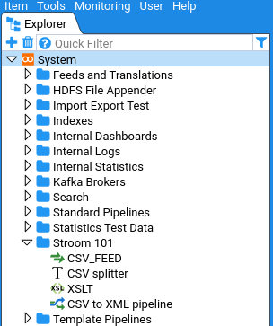
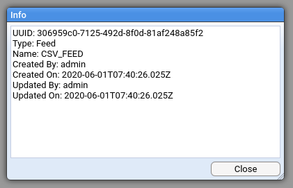

> * Version Information: Created with Stroom v7.0  
* Last Updated: 01 Jun 2020  

# Finding Things

This section describes how to find things in Stroom, for example content, simple string values, etc.

## Explorer Tree



The _Explorer Tree_ in stroom is the primary means of finding user created content, for example _Feeds_, _XSLTs_, _Pipelines_, etc.

Branches of the _Explorer Tree_ can be expanded and collapsed to reveal/hide the content at different levels.

### Filtering by Type

The _Explorer Tree_ can be filtered by the type of content, e.g. to display only _Feeds_, or only _Feeds_ and _XSLTs_.
This is done by clicking the filter icon </img>.
The following is an example of filtering by _Feeds_ and _XSLTs_.


Clicking _All/None_ toggles between all types selected and no types selected.

### Filtering by Name

The _Explorer Tree_ can be filtered by the name of the entity. This is done by entering some text in the _Quick Filter_ field. The tree will then be updated to only show entities matching the _Quick Filter_. The way the matching works for entity names is described in [Common Fuzzy Matching](#common-fuzzy-matching)

### Filtering by UUID

#### What is a UUID?

The _Explorer Tree_ can be filtered by the UUID of the entity.
The UUID [Universally unique identifier](https://en.wikipedia.org/wiki/Universally_unique_identifier) is an identifier that can be relied on to be unique both within the system and universally across all other systems.
Stroom uses UUIDs as the primary identifier for all content (Feeds, XSLTs, Pipelines, etc.) created in Stroom.
An entity's UUID is generated randomly by Stroom upon creation and is fixed for the life of that entity.

When an entity is exported it is exported with its UUID and if it is then imported into another instance of Stroom the same UUID will be used.
The name of an entity can be changed within Stroom but its UUID remains un-changed.

With the exception of _Feeds_, Stroom allows multiple entities to have the same name. This is because entities may exist that a user does not have access to see so restricting their choice of names based on existing invisible entities would be confusing.
Where there are multiple entities with the same name the UUID can be used to distinguish between them.

The UUID of an entity can be viewed using the context menu for the entity.
The context menu is accessed by right-clicking on the entity.


Clicking _Info_ displays the entities UUID.



The UUID can be copied by selecting it and then pressing `ctrl-c`.

#### UUID Quick Filter Matching

In the _Explorer Tree_ _Quick Filter_ you can filter by UUIDs in the following ways:

To show the entity matching a UUID, enter the full UUID value (with dashes), e.g. `a95e5c59-2a3a-4f14-9b26-2911c6043028`.

To match on entities whose UUID contains the entered text, prefix the partial UUID with a `#`, e.g. `#2a3a`.


## Suggestion Input Fields

Stroom uses a number of suggestion input fields, such as when selecting Feeds, Pipelines, types, status values, etc. in the pipeline processor filter screen.


These fields will typically display the full list of values or a truncated list where the total number of value is too large.
Entering text in one of these fields will use the fuzzy matching algorithm to partiall/fully match on values.
See [CommonFuzzy Matching](#common-fuzzy-matching) below for details of how the matching works.


## Common Fuzzy Matching

A common fuzzy matching mechanism is used in a number of places in _Stroom_.
It is used for partially matching the user input to a list of a list of possible values.

In some instances, the list of matched items will be truncated to a more manageable size with the expectation that the filter will be refined.

The fuzzy matching employs a number of approaches that are attempted in the following order:

NOTE: In the following examples the `^` character is used to indicate which characters have been matched.


### No Input

If no input is provided all items will match.

### Word Boundary Matching

If the user input is prefixed with a `?` character then word boundary matching will be employed.
This approaches uses upper case letters to denote the start of a word.
If you know all the words in the item you are looking for then condensing those words down to their first letters (capitalised) makes this a more targeted way to find what you want than the characters anywhere matching above.
Words can either be separated by characters like `_- ()[]`, or be distinguished with `lowerCamelCase` or `upperCamelCase` format.
An upper case letter in the input denotes the beginning of a 'word' and any subsequent lower case characters are treated as contiguously following the character at the start of the word.

**User input**: `?OTheiMa`

**Will match**: 

```
the cat sat on their mat
            ^  ^^^^  ^^                                                                  
ON THEIR MAT
^  ^^^^  ^^ 
Of their magic
^  ^^^^  ^^   
o thei ma
^ ^^^^ ^^
onTheirMat
^ ^^^^ ^^ 
OnTheirMat
^ ^^^^ ^^ 
```


**Won't match**: `On the mat`, `the cat sat on there mat`, `On their moat`


**User input**: `?MFN`

**Will match**: 

```
MY_FEED_NAME
^  ^    ^   
MY FEED NAME
^  ^    ^   
THIS_IS_MY_FEED_NAME_TOO
        ^  ^    ^                  
myFeedName
^ ^   ^   
MyFeedName
^ ^   ^   
my-feed-name
^  ^    ^   
MFN
^^^
```

**Won't match**: `myfeedname`, `NOT MY FEED NAME`


### Regular Expression Matching

If the user input is prefixed with a `/` character then the remaining user input is treated as a Java syntax regular expression.
An string will be considered a match if any part of it matches the regular expression pattern.
The regular expression operates in case insensitive mode.

**User input**: `/(^|wo)man`

**Will match**: 
```
MAN
^^^
A WOMAN
  ^^^^^
Manly
^^^  
Womanly
^^^^^  
```

**Won't match**: `A MAN`, `HUMAN`


### Exact Match

If the user input is prefixed with a `^` character and suffixed with a `$` character then a case-insensitive exact match will be used. E.g:

**User input**: `^xml-events$`

**Will match**: 

```
xml-events
^^^^^^^^^^
XML-EVENTS
^^^^^^^^^^
```

**Won't match**: `xslt-events`, `XML EVENTS`, `SOME-XML-EVENTS`, `AN-XML-EVENTS-PIPELINE`

Note: Despite the similarity in syntax, this is NOT regular expression matching.


### Starts With

If the user input is prefixed with a `^` character then a case-insensitive starts with match will be used. E.g:

**User input**: `^events`

**Will match**: 

```
events
^^^^^^
EVENTS_FEED
^^^^^^     
events-xslt
^^^^^^     
```

**Won't match**: `xslt-events`, `JSON_EVENTS`

Note: Despite the similarity in syntax, this is NOT regular expression matching.

### Ends With


If the user input is suffixed with a `$` character then a case-insensitive ends with match will be used. E.g:

**User input**: `events$`

**Will match**:

```
events
^^^^^^
xslt-events
     ^^^^^^
JSON_EVENTS
     ^^^^^^
```

**Won't match**: `EVENTS_FEED`, `events-xslt`

Note: Despite the similarity in syntax, this is NOT regular expression matching.


### Characters Anywhere Matching

If no prefixes or suffixes are used then all characters in the user input will need to appear in the matched item in the order input.
The matching is case insensitive.

**User input**: `bad`

**Will match**:

```
Big Angry Dog
^   ^     ^  
bad angry dog
^^^          
BAD
^^^
badly
^^^  
Very bad
     ^^^
b a d
^ ^ ^
bbaadd
^ ^ ^ 
```

**Won't match**: `dab`, `ba`


